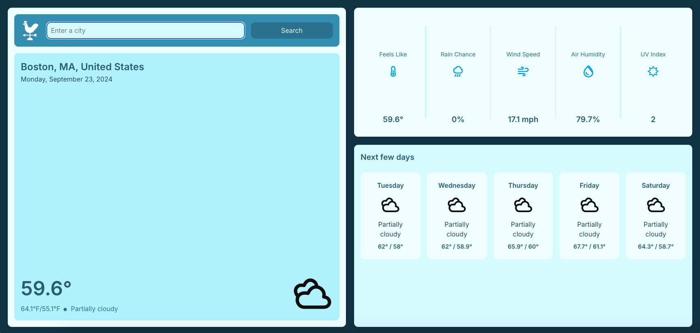
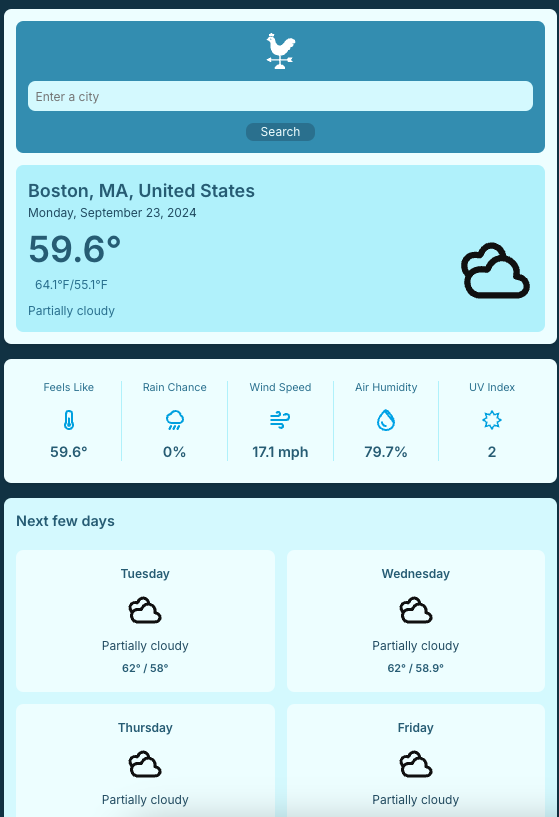

# Weather App

## Overview
A simple weather application built with HTML, CSS, and JavaScript. This project was created as a learning exercise to practice front-end web development skills.

## Features
- Display current weather for a given location
- Show temperature, humidity, and wind speed
- Simple and intuitive user interface

## Live Preview
You can try the live version of the Matrix Solver at the following link: [Weather App Live Preview](https://kingliban.github.io/weather-app/)


## Dynamic


## Getting Started

### Prerequisites
- A modern web browser
- (Optional) Node.js and npm if you want to use webpack for development

### Running the Application
1. Clone the repository:
   ```bash
   git clone https://github.com/KingLiban/weather-app.git
   cd weather-app
   ```

2. Open `index.html` in your web browser.

### Development (Optional)
If you want to make changes and use webpack:

1. Install dependencies:
   ```bash
   npm install
   ```

2. Run webpack to build the project:
   ```bash
   npx webpack
   ```

## License
This project is licensed under the MIT License.